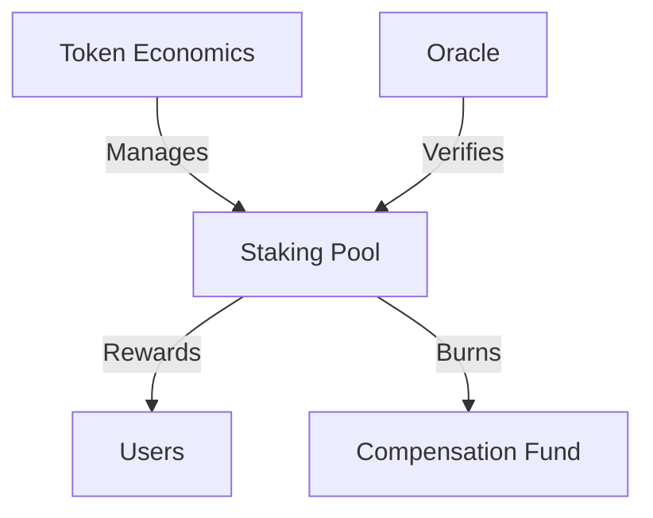

### Team "Ъ" final project for the CFA training course from Alfa-Bank. 

## 🤝 Team members
Абрамов Олег Егорович,
Кулемина Татьяна Николаевна,
Томашова Валерия Дмитриевна,
Куделина Алина Андреевна,
Сарычев Артемий Игоревич,
Бутаков Максим Евгеньевич,
Засухин Трофим Алексеевич.


# 🌳 Forest Protection Token (FPT)
[](https://opensource.org/licenses/MIT)
[](https://sui.io/)
[](https://github.com/your-repo)
> Инновационный DFA для защиты лесов через токенизацию и стейкинг


## 📋 Содержание
- [Обзор](#-обзор)
- [Архитектура](#-архитектура)
- [Установка](#-установка)
- [Использование](#-использование)
- [Тестирование](#-тестирование)
- [Документация](#-документация)
- [Вклад в проект](#-вклад-в-проект)
- [Лицензия](#-лицензия)


## 🎯 Обзор
Forest DFA - это ЦФА, объединяющий защиту лесов с DeFi механизмами. Пользователи могут участвовать в защите лесов через стейкинг токенов, получая награды при отсутствии лесных пожаров.


### Ключевые особенности
- 🌿 Защита лесов через токенизацию
- 💰 Динамическая система наград
- 🔐 Безопасный стейкинг
- 📊 Прозрачная экономическая модель
- 🤝 Интеграция с оракулами


## 🏗 Архитектура



### Компоненты системы
- `TokenEconomics`: Управление токеномикой
- `StakingPool`: Управление стейкингом
- `Oracle`: Верификация состояния лесов


## 💻 Установка
```bash
# Клонирование репозитория
git clone https://github.com/cryptounit777/cfa_token.git

# Установка зависимостей
cd forest-protection-token
sui move build

# Конфигурация
cp .env.example .env
```


## 🚀 Использование
### Деплой контракта
```bash
sui client publish --gas-budget 100000000
```


### Инициализация
```bash
# Инициализация экономики токена
sui client call --function initialize_economics --module token --package $PACKAGE_ID

# Создание стейкинг пула
sui client call --function create_pool --module token --package $PACKAGE_ID \
    --args $FOREST_ID $PERIOD_LENGTH $MIN_STAKE
```


## 🧪 Тестирование
```bash
# Запуск всех тестов
sui move test

# Запуск конкретного теста
sui move test forest_protection_token_tests
```

## 🤝 Вклад в проект
Мы приветствуем вклад в развитие проекта! Пожалуйста, ознакомьтесь с нашим [руководством по содействию](CONTRIBUTING.md).
1. Форкните репозиторий
2. Создайте ветку для фичи (`git checkout -b feature/amazing-feature`)
3. Закоммитьте изменения (`git commit -m 'Add amazing feature'`)
4. Пушните ветку (`git push origin feature/amazing-feature`)
5. Откройте Pull Request

## 📄 Лицензия
Распространяется под лицензией MIT. Смотрите [LICENSE](LICENSE) для получения дополнительной информации.

## 🙏 Благодарности
- [Sui Network](https://sui.io/)
- [Move Language](https://github.com/move-language/move)
- [OpenZeppelin](https://openzeppelin.com/)

---
<p align="center">
Сделано с ❤️ для защиты лесов
</p>
